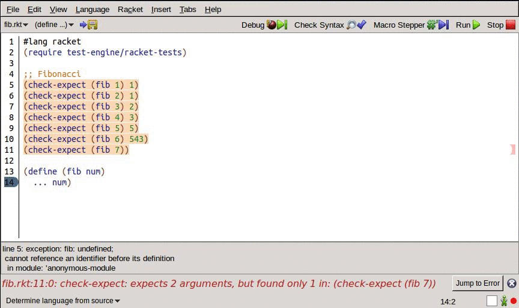

Racketeer
=========

A continuous testing plugin for DrRacket.



Installation
--------------

#### From DrRacket
1. Download [this file](./racketeer.plt) (TODO: Link to the compiled plt file)
2. Open DrRacket: File -> Install .plt file
3. Select racketeer.plt

#### From source with raco

```
git clone https://s4b8@stash.ugrad.cs.ubc.ca:8443/scm/qwerty/racketeer.git
raco link racketeer
raco setup racketeer
```

or

```
git clone https://s4b8@stash.ugrad.cs.ubc.ca:8443/scm/qwerty/racketeer.git
raco pkg install racketeer
```

Usage
-------
1. Code
2. Look at tests
3. Repeat

Highlighting can be toggled on or off at File -> Racketeer Test Highlighting


Uninstalling
-------------

#### From DrRacket
In DrRacket, go to Preferences -> Tool and disable the plugin.

\*DrRacket doesn't yet have a good way to completely remove plugins.

#### From source
```
raco pkg remove plugin-name
```
